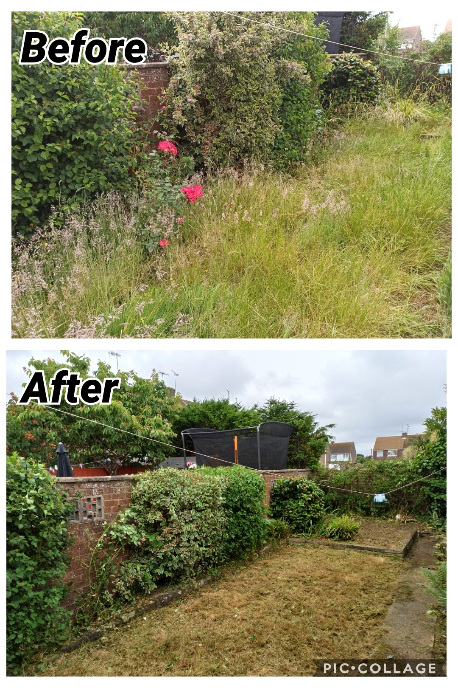

## Why do our designs go wrong?

### Chaos and order

In science, chaos is characterized by sameness and order is characterized by difference and complexity.

{width=300}

An analogy can be made with the gardens. If we don't take care of our gardens, they will become chaotic and overgrown. It could be reestructured and organized, but it will take a lot of time and effort. If by originally we take care of our gardens, they will be orderly and beautiful. It will take less time and effort to maintain them.

### Encapsulation and abstraction

Encapsulation is interwoven with two ideas: simplifying behavior and hiding data. In this context, we are referring to the first idea.
We need to rememeber that at the moment of coding this means to give tasks to a well-defined object or function.

We have three differnt levels of abstraction in the following example:

Urlib

```{python}
import json
from urllib.request import urlopen
from urllib.parse import urlencode
params = dict(q='Sausages', format='json')
handle = urlopen('http://api.duckduckgo.com' + '?' + urlencode(params))
raw_text = handle.read().decode('utf8')
parsed = json.loads(raw_text)
results = parsed['RelatedTopics']
for r in results:
    if 'Text' in r:
        print(r['FirstURL'] + ' - ' + r['Text'])
```

Requests

```python
import requests
params = dict(q='Sausages', format='json')
parsed = requests.get('http://api.duckduckgo.com/', params=params).json()
results = parsed['RelatedTopics']
for r in results:
    if 'Text' in r:
        print(r['FirstURL'] + ' - ' + r['Text'])
```

DuckDuckGo module

```python
import duckduckgo
for r in duckduckgo.query('Sausages').results:
    print(r.url + ' - ' + r.text)
```

All three examples do the same thing, but the first one is more less-readable and requires more knowledge about how to use the API.

### Layering

In software engineering we should care the interactions between objects and functions. Avoid dependecies between them. We can achieve this by layering our code. The idea is to have a layer of objects and functions that are independent of each other, and then have rules for how the layers can interact with each other. This way, we can change one layer without affecting the others.

### The Dependency Inversion Principle

The Dependency Inversion Principle states that high-level modules should not depend on low-level modules. Both should depend on abstractions. Additionally, abstractions should not depend on details. Details should depend on abstractions (What does this mean?). For a further understanding of this principle, we can look at the SOLID principles.

High-level modules are those that contain complex logic and are responsible for the overall behavior of the system **(in other words, they are the important ones in ultimate instance and refer to the real-world concepts)**.

Low-level modules are those that contain simple logic and are responsible for specific tasks. They are not intesting in themselves, but they are important in other ways because they provide the building blocks for the high-level modules and because they are susceptible to optimization.

Depends on refers to an idea that one module knows about or needs to know about another module.

High-level modules should be easy to modify in response to business requirements. Low-level modules should be easy to modify in response to changes in technology or other external factors. Though, in practice, low-level are harder to change.
#### Note:

SOLID is an acronym for five principles of object-oriented programming and design. The Dependency Inversion Principle is one of them. (See the SOLID appendix for more information.)

