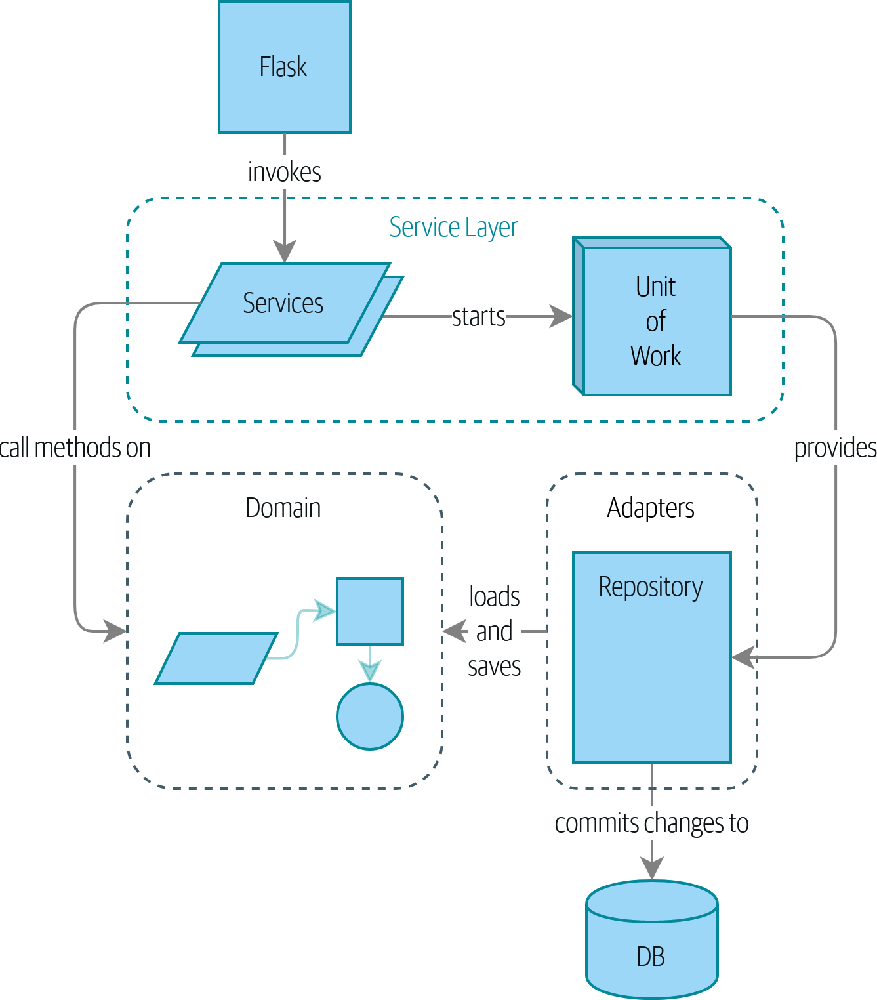
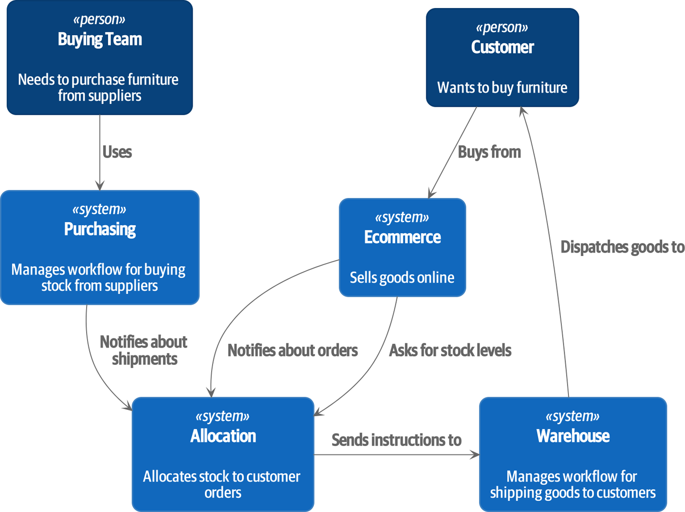

## Introduction to part one: Building an architecture to support domain modeling

>"Pero el traducir de una lengua en otra, si no es de las reinas de las lenguas, griega y latina, es como quien mira los tapices flamencos por el revés; que aunque se ven las figuras, son llenas de hilos que las escurecen, y no se ven con la lisura y tez de la haz.— MIGUEL DE CERVANTES (Don Quijote, II, lxii)

>Most developers have never seen a domain model, only a data model.— CYRILLE MARTRAIRE

>The behavior comes first and after that we drive the storage requirements.— ANONYMOUS AGILE ENGINEER

We should not start with the data model, we need to understand the deepest part of what the business is. We need to build an object model trough Test-Driven Development and that means to create a well designed system of abstractions, objects and behaviors before the construction of the data base.

## What is a domain model?

Domain is a word that refers to the problem you're trying to solve and model refers to the map of processes or phenomena that captures a useful property.
Sometimes a model is "short" for certain purposes but that doesn't mean our model is wrong.

Jargon is a natural part of working large periods of time with this kind of systems. We can think it as a spacecraft with a lot of buttons and leverages. At first with cannot understand for what is each component, after some time we can use the ship's functions in an easy way and more time after we can make complex processes like "do a warp" or "start landing sequence". That are different stages of the abstractions that we make in our heads.

We can think in an example of a retailer.

If we try to introduce a new wat of allocating stock we need to think in the change of behavior we'll need to face, remembering at the same time to use the jargon of business.

## Unit testing domain models

We need to prove that our methods and objects work fine in all the logical cases. All this tests are atomic because we assert our minimal pieces of code work.

We can automatize this process by defining specific functions to do that ardous task.

Keep always in your mind a real business system complexity grows faster you can imagine.

## Dataclasses are great for value objects

If we have a concept that has data but no idenity we choose to represent it using a value object pattern and we usually create the value objects as immutables.

Also the dataclasses give us value equality.

## Value objects and entities

The entities have a long-lived identity and have identity equality. It works thanks to hashing.

## Domain service function

We trest some things as function because they are relations between entities or value objects.

