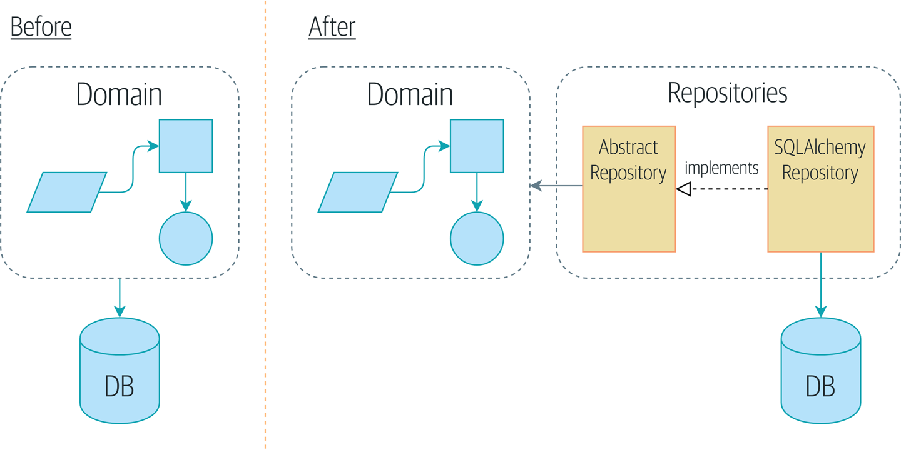

The repository pattern is a simplifying abstraction over data storage that makes our system more testable by hiding the complexities of the database.

## Persisting our domain model

To create a minimum viable product we need to add persistence to our software.

## Applying the DIP to data access

The objective is to keep the layers separate, and to have each layer depend only on the one below it, not between modules of the same level.

But we want our domain model to have no dependencies whatsoever and only accepting helper libraries.

**ONION ARCHITECTURE**

## Model depends on ORM

The frameworks that help to generate SQL for you based on your model objects are called **object-realtional mappers.** 

Our domain model doesn't need to know anything about the way the data is persisted and loaded, in other word it allow us to have persistence ignorance.

Note: We will be using SQLAlchemy.

How we can say that our model is ignorant of the database if it is directly coupled to database columns?

## Introducing the repository pattern

It pretends that all of our data is in memory.

## The repository in the abstract

The simplest repo has only two methods: add and delete.

## What is the trade-off?

We will have to write a few lines of code in our repository class each time we add a new domain object that we want to retriev, but in return we get a simple abstraction over our storage layer, which we control.

### Integration test

We will be checking that our code is correctly integrated with the database.

## What is a port and what is an adapter?

Port: is the interface between our application and whatever it is we wish to abstract away.

Adapter: is the implementation behind that interface or abstraction.

Abstract Repository is the port and SQLAlchemyRepository and FakeRepository are the adapters.